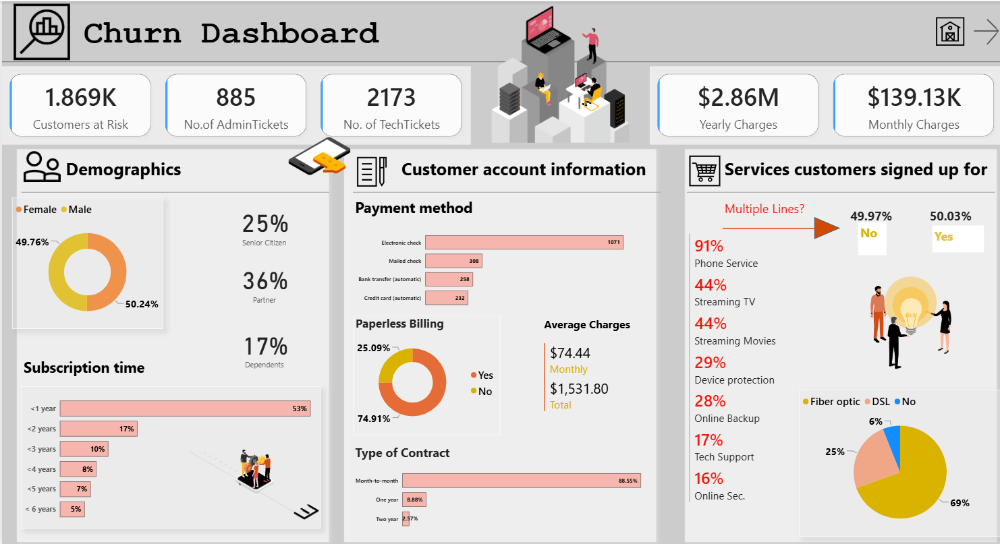
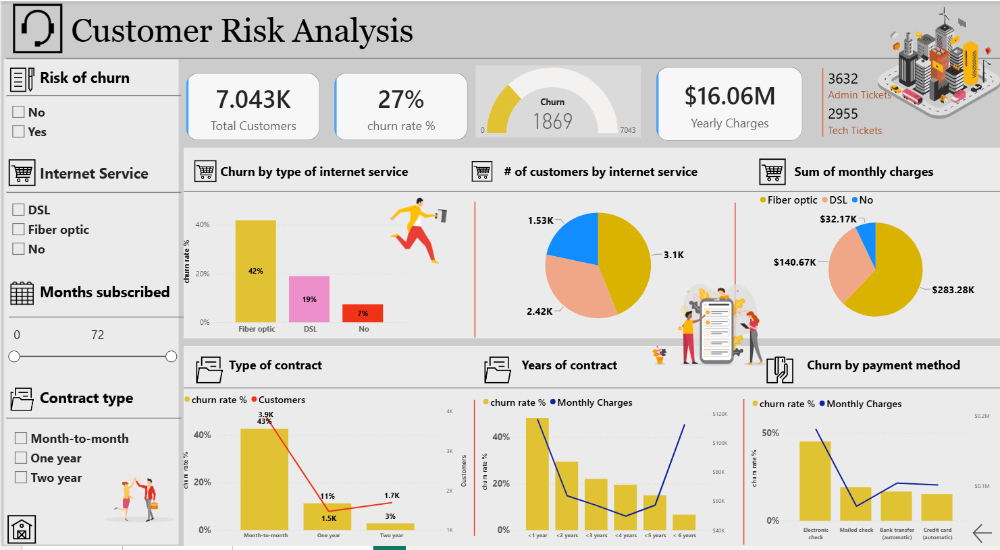

# 📉 Customer Churn Dashboard

---  

## 📸 Dashboard Preview

 
---

## 📌 Overview

The **Customer Churn Dashboard** provides a comprehensive view of customer churn, retention, and risk. It helps stakeholders understand customer behavior, monitor attrition trends, identify customers who may be at risk of leaving, and explore key business metrics through an interactive Power BI report.

The dashboard is organized into three main sections:

* **Key Performance Indicators (KPIs)**
* **Churn Dashboard**
* **Customer Risk Analysis**

---

## 🚀 Features

* **Customer Churn Analysis** – Analyze customer churn patterns and attrition trends
* **Churn Rate** – Track the percentage of customers who have churned
* **Churn Prediction** – Identify customers who may be likely to churn using historical data and predictive insights
* **Customer Demographics** – Understand which customer segments are more prone to churn
* **Customer Risk Analysis** – Evaluate risk across individual customers and customer groups
* **Interactive Navigation** – Move between KPI, Churn Dashboard, and Customer Risk Analysis pages from the welcome page

---

## 📊 Key Metrics

* **Total Number of Customers** – Overall customer count
* **Churn Percentage** – Percentage of customers who have churned
* **Yearly Charges** – Total annual charges associated with customers
* **Admin Tech Tickets** – Number of administrative/technical support tickets

---

## 📈 Visualizations

The dashboard uses multiple Power BI visuals to make churn patterns easier to understand:

* **Bar Chart** – Churn by customer segment
* **Pie Chart** – Retained customers vs. churned customers
* **Line Chart** – Churn trends over time
* **Churn Prediction Gauge** – Predicted churn rate
* **KPI Cards** – Customer count, churn percentage, yearly charges, and other important metrics
* **Multi-Row Card** – Administrative and technical ticket information

---

## 🎛️ Filters (Slicers)

* **Monthly Subscription Date** – Filter customers by subscription date
* **Contract Type** – Analyze churn and customer risk by contract type

Users can also interact with dashboard visuals, use tooltips, apply filters, and drill down into customer segments for more detailed analysis.

---

## 📂 Data Source

The dataset contains customer records including:

* Customer demographics
* Customer behavior
* Subscription information
* Historical churn data
* Customer charges
* Support ticket information

These fields support customer segmentation, churn analysis, and identification of churn tendencies across different customer groups.

---

## ⚙️ Requirements

* **Power BI Desktop** – May 2024 or later recommended
* No additional dependencies required

---

## 🧑‍💻 Usage

1. Clone or download this repository.
2. Open the Power BI `.pbix` file using **Power BI Desktop**.
3. Use the welcome page to navigate between **KPIs**, **Churn Dashboard**, and **Customer Risk Analysis**.
4. Apply slicers and filters to focus on specific customer groups.
5. Hover over visuals to view additional details and use drill-down functionality where available.

---

## 💡 Dashboard Insights

The dashboard can be used to:

* Identify customer segments with higher churn rates
* Understand customer attrition patterns
* Evaluate customer risk levels
* Identify potentially high-risk customers for retention efforts
* Analyze support ticket patterns and their relationship with customer experience
* Monitor customer and financial KPIs at a glance

---

## 🔮 Future Enhancements

* Add a **Customer Retention Strategies** section with recommended actions based on churn and risk
* Add **Customer Feedback Analysis** to study the relationship between customer sentiment and churn

---
## 👤 Author

**Krish Shah**  
Data Analytics | Power BI

This dashboard was designed and developed by **Krish Shah**.

---

## 🛠️ Built With

* **Microsoft Power BI** – Dashboard development and data visualization

---
